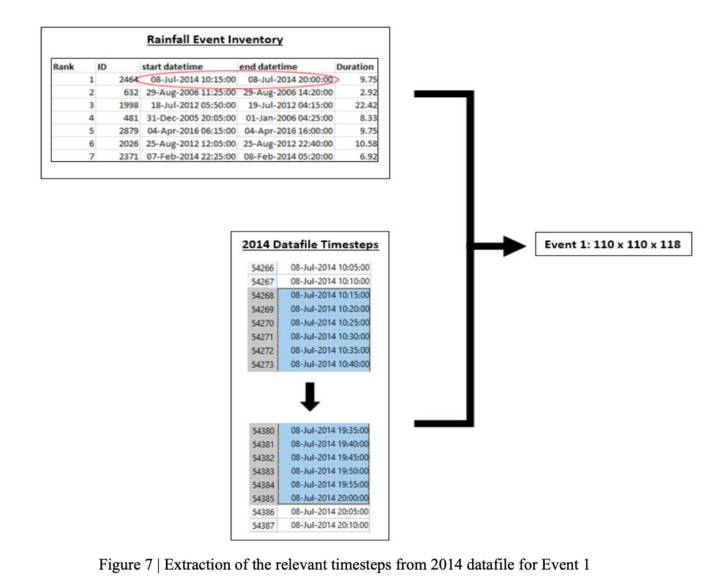
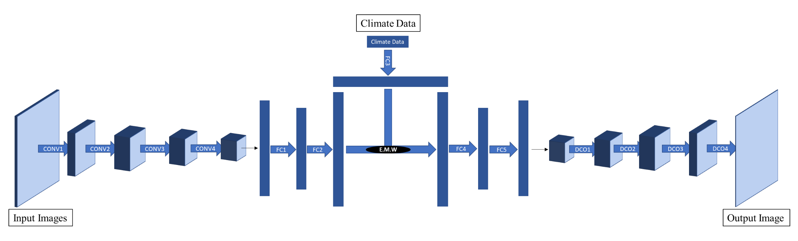

# Short-Term Rainfall Cell Forecasting with Artificial Neural Networks
CIVE97003 Individual Research Project

## Problem Statement
Climate change has led to increased rainfall intensities, exacerbating the risk of flooding. Current forecasting models use physical or data-driven approaches, with data-driven models gaining popularity due to their ability to capture statistical relationships. Traditional statistical models like ARIMA have limitations in predicting sudden changes and skewed distributions. Machine Learning (ML) models, particularly Convolutional Neural Networks (CNNs), are proposed for rainfall forecasting using historical rainfall images. The research aims to investigate the effectiveness of CNNs trained on historical rainfall images alone and in combination with climatological data, with the latter being a novel approach. By identifying areas susceptible to high rainfall, this research can contribute to the development of accurate rainfall forecasting models and effective flood prediction systems.

## Methodology and Approach
First, preprocessing was conducted to extract the rainfall images corresponding to each of the 157 historical storm events. Each image was a 110km x 110km image, with each pixel representing a 1km x 1km grid area. Then, for any pixels within each image that are considered "anomalous", they are replaced by the spatially average rainfall intensities from the surrounding 8 pixels. This process was repeated for all 157 historical storm events.

Then, two types of Convolutional Neural Networks were trained.
1. Architecture inspired by Ayzel et. al. (2019), which takes 3 rainfall images as inputs and predicts the next rainfall image in the temporal sequence.
2. Architecture inspired by Kosson, Mu, and Wang (2017), which takes tabular climatological data in addition to rainfall images as inputs to predict the next rainfall image in the temporal sequence. This was inspired by action conditioned video game frame prediction - predicting the next frame in a video game based on historical frames and a player's actions.

The following experiments were also conducted:
- Spatial aggregations from 1km x 1km to 5km x 5km
- Loss functions and hyperparameter tuning
- Varying input channel dimensions
- Input timestep irregularity
- Increased forecast lead time (more than 5 minutes)
- Increased temporal resolution

The models were primarily evaluated on a classification basis. Namely, if the predicted rainfall intensity for any pixel exceeded a threshold intensity defined by the UK Met Office, we classify the pixel as a flood. Otherwise, no flooding is predicted. This results in a binary classification for each pixel for each image. Hence, the model was evaluated using F1-Scores, Precision, and Recall.

## Results and Discussion
Overall, the model struggled to identify flood pixels. This is because the distribution of "flood" to "non-flood" pixels were 99:1. As a result, the model becomes biased towards predicting zero intensity rainfall and struggles to accurately identify and predict higher intensity rainfall events (i.e., intensities resulting in flooding). This bias towards zero intensity pixels can lead to lower recall rates, as the model is less capable of correctly identifying and predicting extreme rainfall events. More detailed results and discussions can be found in the report.

## Report
[CIVE97003 Report](./CID01380105-FYP-Report.pdf)

## Poster
[CIVE97003 Poster](./CID01380105-FYP-Poster.pdf)

